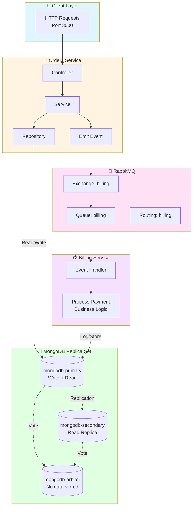
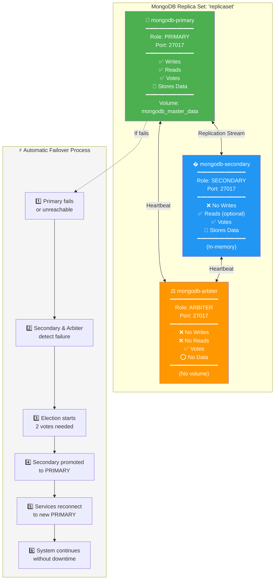
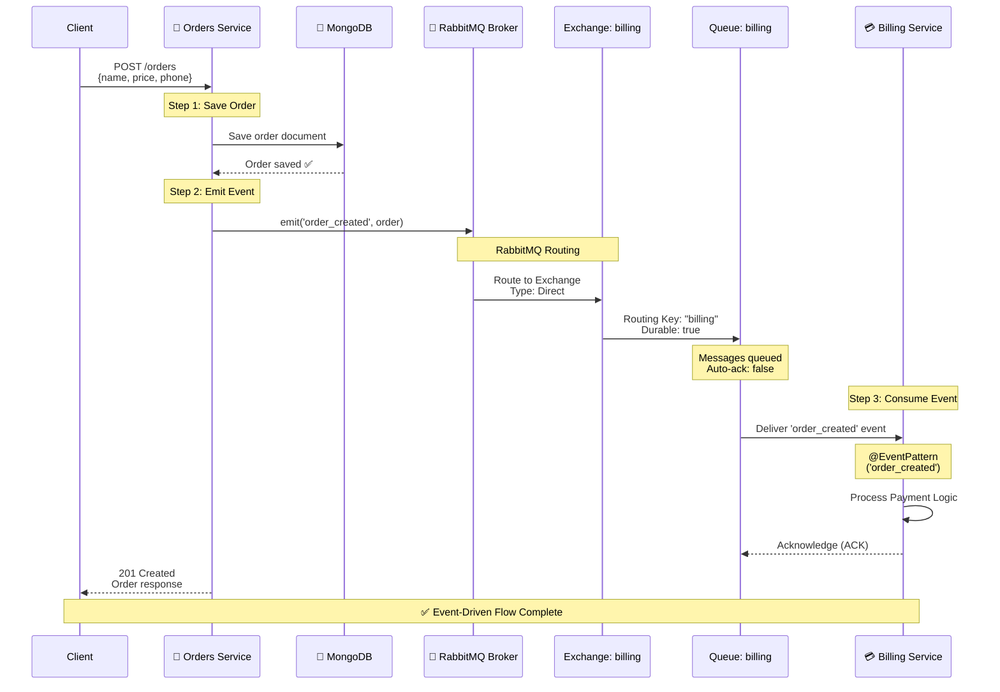

# 🚀 Ordering App - Microservices Architecture

A production-ready microservices application built with **NestJS**, **MongoDB Replica Set**, and **RabbitMQ** for event-driven communication.

## 📋 Table of Contents

- [Architecture Overview](#-architecture-overview)
- [System Architecture Diagram](#-system-architecture-diagram)
- [MongoDB Replica Set](#-mongodb-replica-set-architecture)
- [RabbitMQ Event Flow](#-rabbitmq-event-flow)
- [Technologies Stack](#-technologies-stack)
- [Prerequisites](#-prerequisites)
- [Quick Start](#-quick-start)
- [Project Structure](#-project-structure)
- [Environment Configuration](#-environment-configuration)
- [Docker Commands](#-docker-commands)
- [Deployment](#-deployment-to-production)
- [Troubleshooting](#-troubleshooting)

---

## 🏗️ Architecture Overview

This application implements a **microservices architecture** with event-driven communication, consisting of three independent services:

| Service        | Port   | Description                   | Repository Pattern     |
| -------------- | ------ | ----------------------------- | ---------------------- |
| **🛒 Orders**  | `3000` | Order creation and management | ✅ Abstract Repository |
| **🔐 Auth**    | TBD    | User authentication & JWT     | ✅ Planned             |
| **💳 Billing** | N/A    | Payment processing via events | ✅ Event-driven        |

### Key Features

- ✅ **Event-Driven Architecture** with RabbitMQ
- ✅ **High Availability** with MongoDB Replica Set (3 nodes)
- ✅ **Hot Reload** in Docker for development
- ✅ **Repository Pattern** for database abstraction
- ✅ **Shared Common Libraries** (Database, RMQ)
- ✅ **TypeScript** with strict type checking
- ✅ **Monorepo** structure with PNPM workspaces

---

## 🎯 System Architecture Diagram



### Communication Flow

1. **Client → Orders Service** (HTTP POST `/orders`)
2. **Orders Service → MongoDB Primary** (Save order to database)
3. **Orders Service → RabbitMQ** (Emit `order_created` event)
4. **RabbitMQ → Billing Service** (Deliver event to subscriber)
5. **Billing Service** (Process payment logic)

---

## 🍃 MongoDB Replica Set Architecture

### What is a Replica Set?

A **MongoDB Replica Set** is a group of MongoDB instances that maintain the same data, providing **high availability** and **data redundancy**.

### Our Configuration (3-Node Replica Set)



### Key Environment Variables

```yaml
# mongodb-primary
MONGODB_REPLICA_SET_MODE=primary        # Defines role
MONGODB_ROOT_PASSWORD=password123       # Authentication
MONGODB_REPLICA_SET_KEY=replicasetkey123  # Shared secret for cluster

# mongodb-secondary
MONGODB_REPLICA_SET_MODE=secondary      # Defines role
MONGODB_INITIAL_PRIMARY_HOST=mongodb-primary  # Connect to primary
MONGODB_REPLICA_SET_KEY=replicasetkey123  # MUST match primary

# mongodb-arbiter
MONGODB_REPLICA_SET_MODE=arbiter        # Defines role (no data)
MONGODB_INITIAL_PRIMARY_HOST=mongodb-primary
MONGODB_REPLICA_SET_KEY=replicasetkey123  # MUST match primary
```

### Benefits of Replica Set

| Feature               | Single MongoDB             | Replica Set (Our Setup)    |
| --------------------- | -------------------------- | -------------------------- |
| **High Availability** | ❌ Single point of failure | ✅ Automatic failover      |
| **Data Redundancy**   | ❌ No backup               | ✅ Real-time replication   |
| **Read Scaling**      | ❌ Limited                 | ✅ Read from secondaries   |
| **Zero Downtime**     | ❌ Manual recovery         | ✅ Auto-recovery (~10-30s) |
| **Production Ready**  | ⚠️ Not recommended         | ✅ Industry standard       |

---

## 🐰 RabbitMQ Event Flow

### Architecture Pattern: Event-Driven Microservices



#### 1️⃣ **Orders Service** (Producer)

````typescript
  imports: [
    ConfigModule.forRoot({ isGlobal: true }),
    DatabaseModule,
  ],
  controllers: [OrdersController],
  providers: [OrdersService, OrdersRepository],
```typescript
@Controller('orders')
export class OrdersController {
  constructor(@Inject('BILLING') private billingClient: ClientProxy) {}

  @Post()
  async createOrder(@Body() request: CreateOrderRequest) {
    const order = await this.ordersService.createOrder(request);

    // Emit event to RabbitMQ
    this.billingClient.emit('order_created', order);

    return order;
  }
}
````

#### 2️⃣ **Billing Service** (Consumer)

```typescript
// apps/billing/src/billing.module.ts
@Module({
  imports: [
    ConfigModule.forRoot({ isGlobal: true }),
    RmqModule, // Import RMQ utilities
  ],
  controllers: [BillingController],
  providers: [BillingService],
})
export class BillingModule {}
```

```typescript
// apps/billing/src/main.ts
async function bootstrap() {
  const app = await NestFactory.create(BillingModule);
  const rmqService = app.get<RmqService>(RmqService);

  // Connect to RabbitMQ as microservice
  app.connectMicroservice(rmqService.getOptions('BILLING'));

  await app.startAllMicroservices();
}
```

```typescript
// apps/billing/src/billing.controller.ts
@Controller()
export class BillingController {
  @EventPattern('order_created')
  async handleOrderCreated(@Payload() data: any) {
    console.log('📦 Received order:', data);
    return this.billingService.processPayment(data);
  }
}
```

#### 3️⃣ **Shared RMQ Service** (Common Library)

```typescript
// libs/common/src/rmq/rmq.service.ts
@Injectable()
export class RmqService {
  constructor(private readonly configService: ConfigService) {}

  getOptions(queue: string, noAck = false): RmqOptions {
    return {
      transport: Transport.RMQ,
      options: {
        urls: [this.configService.get<string>('RABBIT_MQ_URI')],
        queue: this.configService.get<string>(`RABBIT_MQ_${queue}_QUEUE`),
        noAck,
        persistent: true,
      },
    };
  }
}
```

### Message Flow Example

```typescript
// 1. Client creates order
POST http://localhost:3000/orders
{
  "name": "Premium Coffee",
  "price": 19.99,
  "phoneNumber": "+1234567890"
}

// 2. Orders Service saves to MongoDB
Order { _id: "...", name: "Premium Coffee", price: 19.99 }

// 3. Orders Service emits event to RabbitMQ
billingClient.emit('order_created', {
  _id: "...",
  name: "Premium Coffee",
  price: 19.99,
  phoneNumber: "+1234567890"
})

// 4. RabbitMQ routes to "billing" queue

// 5. Billing Service receives event
@EventPattern('order_created')
handleOrderCreated(order) {
  // Process payment logic
  console.log('💳 Processing payment for', order.price);
}
```

---

## 🛠️ Technologies Stack

### Core Technologies

| Technology     | Version   | Purpose              |
| -------------- | --------- | -------------------- |
| **NestJS**     | `^10.0.0` | Backend framework    |
| **TypeScript** | `^5.1.3`  | Type-safe JavaScript |
| **MongoDB**    | `6.0`     | NoSQL database       |
| **RabbitMQ**   | `latest`  | Message broker       |
| **Docker**     | `24+`     | Containerization     |
| **PNPM**       | `8+`      | Package manager      |

### Key Libraries

```json
{
  "@nestjs/microservices": "^10.0.0", // Microservices support
  "@nestjs/mongoose": "^10.0.0", // MongoDB integration
  "amqplib": "^0.10.3", // RabbitMQ client
  "amqp-connection-manager": "^4.1.14", // Connection management
  "joi": "^17.9.0" // Environment validation
}
```

## 📋 Prerequisites

Make sure you have the following installed:

- [Node.js](https://nodejs.org/) (v18+ recommended)
- [PNPM](https://pnpm.io/) package manager
- [Docker](https://www.docker.com/) and Docker Compose
- [Git](https://git-scm.com/)

## 🚀 Quick Start

### 1. Clone and Install Dependencies

```bash
# Clone the repository
git clone <repository-url>
cd ordering-app

# Install dependencies
pnpm install

# Install RabbitMQ packages for microservices communication
pnpm add @nestjs/microservices amqplib amqp-connection-manager @types/amqplib
```

### 2. Start Infrastructure Services

```bash
# Start MongoDB Replica Set + RabbitMQ
docker-compose up -d mongodb-primary mongodb-secondary mongodb-arbiter rabbitmq
```

### 3. Start Development Server

```bash
# Start orders service with hot reload
docker-compose up orders

# Or start all services
docker-compose up
```

The orders service will be available at `http://localhost:3000`

## 🐳 Docker Development Setup

### Hot Reload Configuration

Our Docker setup provides **instant hot reload** without rebuilding containers:

```yaml
# docker-compose.yml
services:
  orders:
    build:
      context: .
      dockerfile: ./apps/orders/Dockerfile
      target: development # Multi-stage build for development
    command: npm run start:dev orders
    volumes:
      - .:/usr/src/app # Mount source code
      - /usr/src/app/node_modules # Preserve container's node_modules
    ports:
      - '3000:3000'
```

### How it works:

- ✅ **Real-time updates**: Changes in your local files are instantly reflected in the container
- ✅ **Preserved dependencies**: `node_modules` from container are protected from local conflicts
- ✅ **No rebuilds needed**: Only the Node.js process restarts, not the container
- ✅ **Cross-platform**: Works consistently on Windows, Mac, and Linux

## 🗄️ Database Configuration

### MongoDB Replica Set

The application uses a **3-node MongoDB replica set** for high availability:

- **Primary Node** (`mongodb-primary:27017`) - Handles writes
- **Secondary Node** (`mongodb-secondary:27017`) - Replication + reads
- **Arbiter Node** (`mongodb-arbiter:27017`) - Voting in elections

### Bitnami Secure Images

We use `bitnamisecure/mongodb:latest` for:

- 🛡️ **Enhanced Security**: Minimal attack surface with Photon Linux
- 🔄 **Automatic Updates**: Security patches applied within hours
- 📋 **Compliance**: Includes SBOMs, virus scans, and attestation signatures

## 📨 RabbitMQ Integration

### Package Installation

```bash
# Core RabbitMQ packages
pnpm add amqplib amqp-connection-manager @types/amqplib

# NestJS microservices (includes RabbitMQ integration)
pnpm add @nestjs/microservices
```

### Event Flow Example

```typescript
// 1. Orders service publishes event
@Post()
async createOrder(@Body() order: any) {
  const newOrder = await this.ordersService.createOrder(order);

  // Publish to RabbitMQ
  this.billingClient.emit('order_created', newOrder);

  return newOrder;
}

// 2. Billing service consumes event
@MessagePattern('order_created')
async handleOrderCreated(@Payload() orderData: any) {
  return await this.billingService.processPayment(orderData);
}
```

## 🔧 Available Scripts

```bash
# Development
pnpm run start:dev          # Start with watch mode
pnpm run start:dev orders   # Start specific service

# Production
pnpm run build              # Build all services
pnpm run start:prod         # Start production mode

# Testing
pnpm run test               # Unit tests
pnpm run test:e2e           # End-to-end tests
pnpm run test:cov           # Coverage report

# Linting
pnpm run lint               # ESLint
pnpm run format             # Prettier formatting
```

## 🐋 Docker Commands

```bash
# Start all services
docker-compose up

# Start specific services
docker-compose up orders mongodb-primary rabbitmq

# Background mode
docker-compose up -d

# View logs
docker-compose logs orders

# Rebuild containers
docker-compose build

# Stop all services
docker-compose down

# Clean up volumes
docker-compose down -v
```

## 📁 Project Structure

```
ordering-app/
├── apps/
│   ├── orders/           # Orders microservice
│   ├── auth/             # Authentication service
│   └── billing/          # Billing service
├── libs/
│   └── common/           # Shared libraries
│       ├── database/     # Database abstractions
│       └── rmq/          # RabbitMQ utilities
├── docker-compose.yml    # Container orchestration
└── README.md
```

## 🔧 Environment Configuration

### Required Environment Variables

Create `.env` files in each service directory:

```bash
# apps/orders/.env
DATABASE_URL=mongodb://mongodb-primary:27017/orders
RABBIT_MQ_URI=amqp://rabbitmq:5672
RABBIT_MQ_ORDERS_QUEUE=orders_queue
```

## 🚨 Troubleshooting

### MongoDB Connection Issues

```bash
# Check replica set status
docker exec -it ordering-app-mongodb-primary-1 mongosh --eval "rs.status()"
```

### RabbitMQ Management

```bash
# Access RabbitMQ Management UI (add to docker-compose if needed)
# http://localhost:15672
# Default: guest/guest
```

### TypeScript Compilation Errors

```bash
# Clear build cache
pnpm run build --force

# Check for type issues
pnpm run lint
```

## 🤝 Contributing

1. Fork the repository
2. Create a feature branch (`git checkout -b feature/amazing-feature`)
3. Commit your changes (`git commit -m 'Add amazing feature'`)
4. Push to the branch (`git push origin feature/amazing-feature`)
5. Open a Pull Request

## 📄 License

This project is [MIT licensed](LICENSE).

## 🆘 Support

- 📖 [NestJS Documentation](https://docs.nestjs.com)
- 🐰 [RabbitMQ Tutorials](https://www.rabbitmq.com/tutorials)
- 🍃 [MongoDB Replica Sets](https://docs.mongodb.com/manual/replication/)
- 🐳 [Docker Compose Reference](https://docs.docker.com/compose/)

---

Built with ❤️ using NestJS and modern microservices architecture.
